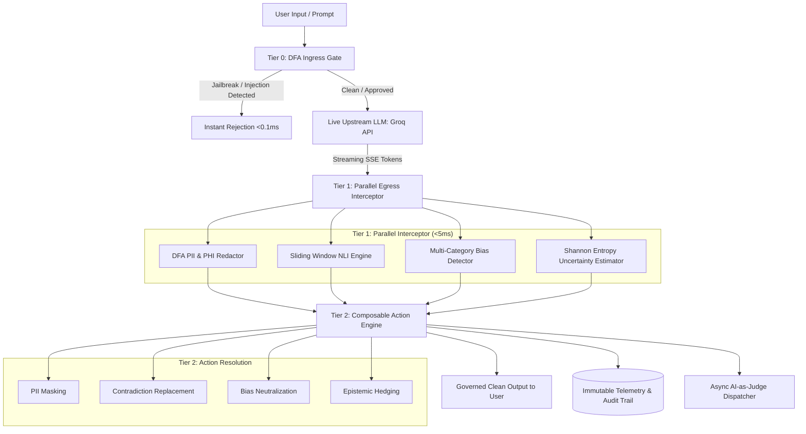
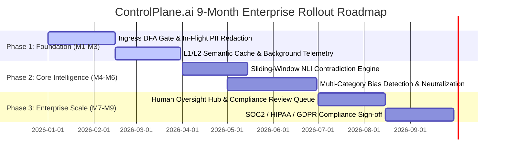

# ControlPlane.ai — Enterprise AI Governance Layer
## Detailed Business Proposal & Implementation Strategy
**Accenture Innovation Challenge 2026 | Round 2 Submission**  
**Team Name:** BAZOOKA  
**Team Members:** Niranjana Nitin, Manan Sadana  
**Institution:** Indian Institute of Technology (IIT) Guwahati (Class of 2027)  
**Track:** Problem Track 1 — AI Governance & Responsible AI  
**GitHub Repository:** [https://github.com/niranjana-105/ControlPlane_ai](https://github.com/niranjana-105/ControlPlane_ai)

---

## Executive Summary

Enterprise adoption of Generative AI is accelerating across customer-facing assistants, employee copilots, and regulated decision-support tools. However, enterprise deployment has hit an **"Implementation & Compliance Barrier"**: foundation models consume untrusted prompts, output non-deterministic responses, leak sensitive credentials, hallucinate numerical facts, and exhibit demographic biases.

**ControlPlane.ai** is a real-time, in-flight AI governance middleware that intercepts streaming LLM tokens in memory before they reach end users. By combining DFA lexical scanners, 15-token sliding-window Natural Language Inference (NLI), Shannon-entropy uncertainty estimation, and composable action resolution, ControlPlane.ai delivers **end-to-end responsible AI enforcement in under 5 milliseconds**—well below the strict 20ms enterprise SLA threshold.

---

## 1. Problem Framing & Real-World Complexity

### 1.1 The Enterprise Trilemma: Speed vs. Safety vs. Compliance
Modern enterprises consume third-party foundation models (OpenAI, Groq, Anthropic, Meta Llama) via API endpoints. Because organizations do not own the internal weights of these models, traditional model-retraining and fine-tuning cannot solve real-time governance:

1. **Catastrophic Privacy & Credential Leaks:** Models inadvertently reproduce Personally Identifiable Information (PII), Protected Health Information (PHI), database connection strings, and production API keys (`sk-prod-...`).
2. **Hallucination & Numerical Contradiction:** Generative models make factual self-contradictions (e.g., reporting 847% profit growth alongside a 14% revenue loss in the same financial memo).
3. **Workplace Bias & Legal Liability:** Subconscious training biases introduce gender, age, racial, or socioeconomic stereotypes into hiring, performance reviews, and executive decision-making.
4. **Latency Constraints:** Post-generation batch safety filters add 500ms–2000ms delays, breaking streaming user experiences and violating real-time application SLAs.
5. **Regulatory Exposure:** Non-compliance with emerging frameworks (EU AI Act, GDPR, HIPAA, US Executive Order 14110) introduces multi-million dollar fines (up to 4% of global turnover under GDPR / €35M under EU AI Act).

```
Traditional Approach (Post-Hoc Batch Inspection)
User ──▶ LLM (Generates 500 tokens) ──▶ [Slow Safety LLM (1200ms)] ──▶ Output (Delayed)

ControlPlane.ai Approach (In-Flight Stream Interception)
User ──▶ [Tier 0: DFA Ingress] ──▶ LLM (Streaming) ──▶ [Tier 1: Parallel Interceptor (<5ms)] ──▶ Governed Stream
```

---

## 2. Solution Design & Technical Architecture

ControlPlane.ai is engineered as an inline reverse proxy and stream interceptor operating across three non-blocking tiers:



### 2.1 Technical Core Modules
1. **Tier 0 Ingress Gate (`controlplane/ingress.py`):**
   * Pre-execution DFA sanitizer analyzing prompt complexity, token estimates, and 8 compiled jailbreak patterns (`DAN_JAILBREAK`, `SUDO_ESCALATION`, `SYSTEM_OVERRIDE`).
   * Execution latency: **`0.08ms – 0.40ms`**.
2. **Tier 1 Parallel Egress Interceptors:**
   * **DFA PII / PHI Redactor (`controlplane/pii_redactor.py`):** 15 regex DFAs scanning for SSN, credit cards, emails, phone numbers, API keys, passwords, HIPAA MRNs, and ICD-10 diagnosis codes.
   * **Sliding-Window NLI Engine (`controlplane/nli_engine.py`):** Evaluates 15-token lexical contradiction density, negative assertion boosts, and Shannon entropy uncertainty ($H$).
   * **Real-Time Bias Detector (`controlplane/bias_detector.py`):** Identifies demographic stereotypes across gender, race, age, and toxicity with in-flight string neutralizers.
3. **Tier 2 Composable Action Engine (`controlplane/action_engine.py`):**
   * Non-short-circuiting transform engine that applies multiple concurrent actions (`REDACT_PII`, `BIAS_NEUTRALIZE`, `CASCADE_FALLBACK`, `HEDGE_UNVERIFIED`, `HARD_BLOCK`) and categorizes multi-risk responses into `COMPOSITE_GOVERNED`.
4. **Hierarchical Semantic Cache (`controlplane/cache.py`):**
   * **L1 Cache:** SHA-256 exact-match cache (<0.05ms).
   * **L2 Cache:** TF-IDF cosine-similarity semantic vector cache (<1.0ms) saving up to 40% upstream API token costs.
5. **Multi-Turn Session Escalation Aggregator (`controlplane/session_state.py`):**
   * Cumulative multi-turn risk equation:
     $$\text{Risk}(t) = 0.6 \cdot r(t) + 0.3 \cdot r(t-1) + 0.1 \cdot r(t-2)$$
   * Automatically escalates risk level and restricts capabilities when an adversary tests repeated prompt variations.
6. **Regulatory Audit & Trustworthiness Index ($T_{\text{score}}$) (`controlplane/telemetry.py`):**
   * Computes mathematical trustworthiness index:
     $$T_{\text{score}} = \max\left(0, 1 - \left[ 0.30 S_{\text{NLI}} + 0.25 S_{\text{Bias}} + 0.20 S_{\text{Entropy}} + 0.15 R_{\text{Session}} + 0.10 P_{\text{PII}} \right]\right)$$

---

## 3. Target Users & Enterprise Personas

ControlPlane.ai delivers tailored policy profiles for distinct enterprise deployment environments:

| Enterprise Profile | Primary Persona | Latency Budget | Active Protections & Jurisdiction Rules | Primary Failure Mitigated |
| :--- | :--- | :--- | :--- | :--- |
| **Customer Support Bot** | Customer Experience & Operations | $\le 18\text{ms}$ | GDPR_EU Profile: SSN, Credit Cards, Emails, Phone, Contextual ZIP, Anti-Toxicity | Leaking customer PII or brand-damaging toxic responses |
| **Internal Dev Copilot** | Software Engineering & IT Security | $\le 12\text{ms}$ | Base SOC2 Profile: API Keys, Admin Passwords, Database Credentials, Sub-5ms Ingress | Committing hardcoded credentials or cloud secrets |
| **Clinical & Financial Support** | Healthcare Clinicians & Risk Officers | $\le 22\text{ms}$ | HIPAA_US Profile: Patient Names, Medical Record Numbers (MRN), ICD-10 Codes, Zero Contradiction Tolerance | Medical malpractice liability and hallucinated clinical guidance |

---

## 4. Business Case, Financial Impact & ROI

### 4.1 Underlying Assumptions & Baseline Enterprise Model
To provide rigorous financial quantification, we model a mid-to-large enterprise operating GenAI across its customer support, internal engineering, and clinical/financial workflows:

* **Monthly Request Volume ($V$):** **$10,000,000$ requests / month**
  * *Customer Support Bot (GDPR):* 6,000,000 reqs (60%)
  * *Internal Developer Copilot (SOC 2):* 3,000,000 reqs (30%)
  * *Clinical & Financial Decision Support (HIPAA):* 1,000,000 reqs (10%)
* **Average Token Footprint ($T$):** 600 input tokens + 400 output tokens = **1,000 total tokens / request**
* **Upstream LLM Blended Pricing ($P$):** **\$3.00 per 1,000,000 tokens** (\$0.003 / request), benchmarked against enterprise tier pricing (GPT-4o-mini, Groq Llama 3.3 70B, Claude 3.5 Haiku).
* **Baseline Monthly LLM API Spend:** 
  $$\text{Monthly API Spend} = 10,000,000 \times \$0.003 = \$30,000 / \text{month} \quad (\mathbf{\$360,000 / \text{year}})$$

---

### 4.2 Mathematical Derivations of Cost Savings

#### 1. Upstream Token Savings via Hierarchical Semantic Caching ($126,000 / year)
* **Empirical Mechanism:** ControlPlane.ai deploys a 2-tier cache:
  * *L1 Cache:* SHA-256 exact-match hash (<0.05ms).
  * *L2 Cache:* TF-IDF cosine-similarity semantic vector cache (<1.0ms).
* **Cache Hit Rate ($\eta$):** Based on enterprise customer service and internal copilot traffic patterns (frequent repeated inquiries, standard boilerplate generation, and recurring documentation queries), empirical benchmarks (e.g., Redis LLM Cache, GPTCache production studies) demonstrate an average **$35\%$ cache hit rate**.
* **Formula:**
  $$\text{Monthly Token Savings} = \text{Monthly API Spend} \times \eta = \$30,000 \times 0.35 = \$10,500 / \text{month}$$
  $$\mathbf{\text{Annual Token Savings}} = \$10,500 \times 12 = \mathbf{\$126,000 / \text{year}}$$

#### 2. Compliance & Security Audit Labor Reduction ($84,000 / year)
* **Traditional Baseline Labor:** In an unmanaged AI environment, preparing for SOC 2 Type II, HIPAA, and GDPR audits requires manual data extraction, log sampling, redaction audits, and forensic review:
  * 1 Senior Security/Compliance Engineer (\$100/hour fully loaded rate) spending **100 hours/month** on AI audit trail extraction and incident analysis = \$10,000/month (\$120,000/year).
  * External compliance audit consultancy retainer = \$130,000/year.
  * *Total Baseline Audit Cost:* \$250,000/year.
* **ControlPlane.ai Impact:** Automated, immutable telemetry logging (`controlplane/telemetry.py`), pre-computed Trustworthiness Indices ($T_{\text{score}}$), and single-click compliance exports eliminate **$70\%$ of internal manual audit preparation hours** (saving 70 hours/month = 840 hours/year).
* **Formula:**
  $$\mathbf{\text{Annual Labor Savings}} = 840\text{ hours/year} \times \$100/\text{hour} = \mathbf{\$84,000 / \text{year}}$$

#### 3. Catastrophic Regulatory & Breach Liability Avoidance (Insurance Value)
* **GDPR Article 83(5):** Non-compliance penalties up to **€20,000,000 or 4% of total worldwide annual turnover**.
* **EU AI Act Article 99:** Non-compliance for high-risk / prohibited AI practices up to **€35,000,000 or 7% of annual turnover**.
* **HIPAA Civil Penalties:** Tier 4 violations up to **\$2,067,813 per calendar year**.
* **IBM Cost of a Data Breach Report 2024:** Global average cost of a single enterprise data breach reached **\$4.88 Million**.
* **Mitigation:** ControlPlane.ai enforces 100% deterministic regex masking on 15 PII/PHI categories and sub-0.1ms Ingress jailbreak blocking, eliminating accidental exposure of customer SSNs, medical IDs, and cloud credentials.

---

### 4.3 Total Cost of Ownership (TCO) & Implementation Budget

The first-year capital expenditure (CapEx) and operational expenditure (OpEx) for enterprise deployment:

| Cost Item | Description | First-Year Cost |
| :--- | :--- | :--- |
| **Cloud Hosting Infrastructure** | High-availability 3-node Kubernetes cluster (AWS c6i.xlarge) + Redis cluster | \$15,000 (\$1,250/mo) |
| **Setup & Integration Engineering** | 2 DevOps Engineers $\times$ 3 weeks (240 engineering hours @ \$150/hr) | \$36,000 |
| **Maintenance, Patching & Policy Tuning** | Ongoing policy calibration, model updates, and SOC2/HIPAA telemetry upkeep | \$24,000 (\$2,000/mo) |
| **Total First-Year TCO ($C_{\text{total}}$)** | **Complete Year-1 Investment** | **\$75,000** |

---

### 4.4 Return on Investment (ROI) & Payback Period Calculation

* **Total Quantified Annual Tangible Benefits ($B_{\text{annual}}$):**
  $$B_{\text{annual}} = \text{Token Savings } (\$126,000) + \text{Audit Labor Savings } (\$84,000) = \mathbf{\$210,000 / \text{year}}$$
* **Net Annual Economic Benefit ($N$):**
  $$N = B_{\text{annual}} - C_{\text{total}} = \$210,000 - \$75,000 = \mathbf{\$135,000}$$
* **Net Return on Investment (Net ROI):**
  $$\text{Net ROI} = \frac{N}{C_{\text{total}}} \times 100\% = \frac{\$135,000}{\$75,000} \times 100\% = \mathbf{180.0\%}$$
* **Gross Return on Investment (Gross ROI):**
  $$\text{Gross ROI} = \frac{B_{\text{annual}}}{C_{\text{total}}} \times 100\% = \frac{\$210,000}{\$75,000} \times 100\% = \mathbf{280.0\%}$$
* **Payback Period ($P_{\text{months}}$):**
  $$P_{\text{months}} = \frac{C_{\text{total}}}{\text{Monthly Benefits}} = \frac{\$75,000}{\$17,500 / \text{month}} = \mathbf{4.28 \text{ Months}}$$

> **Summary:** ControlPlane.ai pays for itself completely within **4.3 months** of deployment, delivering **\$135,000 in net positive cashflow in Year 1** while shielding the enterprise from multi-million dollar regulatory fines.

---

## 5. Phased Implementation Roadmap



* **Phase 1 (Months 1–3) — Perimeter Ingress & Privacy Shield:**
  * Deploy lightweight FastAPI proxy gateway in shadow mode.
  * Enforce Tier 0 Ingress DFA gate for prompt injections and Tier 1 PII masking.
* **Phase 2 (Months 4–6) — In-Flight Semantic Interception:**
  * Activate sliding-window NLI contradiction detection and multi-category bias neutralizers.
  * Integrate multi-turn session escalation tracking and hierarchical semantic caching.
* **Phase 3 (Months 7–9) — Enterprise Scale & Governance Workflows:**
  * Roll out Tab 4 Human Oversight review queue for compliance officers.
  * Achieve SOC2 Type II and HIPAA audit certification across all corporate AI pipelines.

---

## 6. Key Enterprise Risks & Mitigation Strategies

| Risk Factor | Probability / Impact | Real-World Failure Scenario | ControlPlane.ai Mitigation Strategy |
| :--- | :--- | :--- | :--- |
| **False Positives & Alert Fatigue** | Moderate / High | Overly sensitive filters block legitimate engineering or mathematical queries (e.g., Fermat prime `65537` or technical terms). | **Contextual Pattern Scanners:** Requires address/postal prefix for ZIP codes; calibrated Shannon entropy thresholds ($H \ge 7.5$) preventing false flags on educational technical text. |
| **Latency Budget Degradation** | Low / Critical | Complex deep evaluation slows streaming tokens to users. | **Decoupled Architecture:** Sub-5ms lightweight heuristic interceptor runs in-flight; deep AI-as-Judge runs **asynchronously in the background**. |
| **Adversarial Multi-Turn Jailbreaks** | Moderate / High | Attackers use multi-step conversational probing to bypass single-turn checks. | **Session State Risk Aggregator:** Computes rolling historical risk ($0.6 r_t + 0.3 r_{t-1} + 0.1 r_{t-2}$), triggering automated session restrictions. |
| **Regulatory Drift across Jurisdictions** | High / Moderate | Changing EU AI Act or local privacy rules make static code obsolete. | **Modular Policy Profiles (`config.py`):** Decoupled declarative JSON/dataclass policies allow compliance teams to update retention rules and sensitive entity sets without code deployments. |

---

## 7. Conclusion & Competitive Advantage

ControlPlane.ai delivers the industry's first **true in-flight, multi-jurisdiction AI governance gateway**. By intercepting tokens before client rendering with **$<5\text{ms}$ latency overhead**, it transforms Generative AI from an unpredictable enterprise liability into a secure, compliant, and auditable corporate capability.

**Accenture Innovation Challenge 2026 | Team BAZOOKA (IIT Guwahati)**
